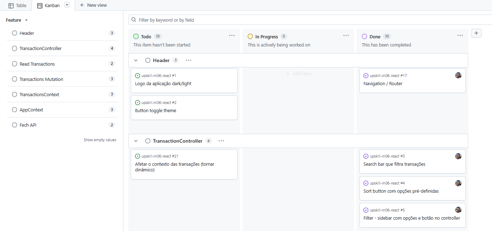

# 🚀 UPskill - Módulo 06 React

Uma aplicação *Single Page Application* (SPA) desenvolvida em React para gestão financeira pessoal. O objetivo é fornecer uma ferramenta simples, intuitiva e em tempo real para ajudar os utilizadores a responderem às perguntas: "onde está o meu dinheiro?", "o que entra?", "o que sai?" e "quanto me sobra?".

* [Visitar Repositório no GitHub.](https://github.com/devgabrielpanta/upskill-m06-react)

## 🗺️ Metodologia de Desenvolvimento

### 👥 Autores

* Gabriel: [@devgabrielpanta](https://www.github.com/devgabrielpanta)
* Antonio: [@antoniocfigueira](https://www.github.com/antoniocfigueira)

### 🎯 Approach

Os programadores criaram um projeto no GitHub integrado com o repositório, onde adicionaram *issues* para cada *feature* a ser desenvolvida com total flexibilidade — ou seja, cada developer teve a oportunidade de adicionar ao projeto as funcionalidades que julgava relevantes. 

Nosso objetivo com essa abordagem foi simular a vivência real e dinâmica de um ambiente organizacional, garantindo transparência, organização e responsabilidade compartilhada.

#### Passo a Passo do Fluxo de Trabalho:

1. **Ideação e Criação de Tarefas:** Qualquer ideia de funcionalidade ou melhoria era registrada como uma *Issue* no repositório, garantindo que o escopo fosse construído de forma colaborativa.
2. **Gestão Visual (Kanban):** Todas as *issues* foram organizadas em um quadro no GitHub Projects utilizando a metodologia Kanban, estruturado nas clássicas colunas:
   * 📋 **To do** (A fazer)
   * ⏳ **In Progress** (Em andamento)
   * ✅ **Done** (Concluído)
3. **Autonomia e Autogerenciamento:** Cada desenvolvedor teve total autonomia para analisar o *backlog* (coluna `To do`) e assumir a responsabilidade por uma tarefa, atribuindo a *issue* a si mesmo (*self-assignment*) e movendo-a para `In Progress`.
4. **Rastreabilidade via Commits:** Para manter a automação e o histórico limpo, utilizamos palavras-chave do GitHub nas mensagens de *commit* (ex: `closes #12`). 
5. **Monitoramento Contínuo:** Ao fazermos o *push* desses commits, a respectiva tarefa era fechada e automaticamente movida para a coluna `Done`. Isso nos permitiu ter uma visão clara e em tempo real do andamento do projeto.

#### 📸 Demonstração do Processo

Abaixo, o registro do nosso quadro Kanban em funcionamento:

  


## ✨ Funcionalidades

* **Dashboard Resumo:** Visualização rápida do saldo atual, total de receitas e total de despesas.
* **Gestão de Transações:** Adição e eliminação de transações (receitas e despesas) com atualização de estado em tempo real.
* **Interface Responsiva:** A lista de transações adapta-se ao dispositivo do utilizador, exibindo uma tabela detalhada em Desktop e cartões (*cards*) compactos em Mobile.
* **Filtros e Ordenação Avançada:** Barra de controlo com pesquisa por texto, ordenação (por data, valor ou categoria) e uma *sidebar* interativa para filtros de tipo e categoria.
* **Design Sóbrio e Moderno:** Interface minimalista, estritamente neutra, com destaque a cores apenas para feedback financeiro (verde para entradas, vermelho para saídas).
* **Modos de Visualização:** Suporte integrado para alternância entre *Light Mode* e *Dark Mode*.

---

## 🛠️ Tecnologias Utilizadas

* **Frontend:** React (Hooks: `useState`, `useEffect`, `useRef`, `useReducer`)
* **Estilização:** CSS / Tailwind CSS (arquitetura pensada para temas claro/escuro)
* **Armazenamento Local:** Browser `localStorage`
* **Mock Data:** Ficheiros locais para simulação de base de dados durante as fases iniciais.

---

## 🏗️ Arquitetura e Componentes

O projeto adota uma estrutura modularizada para facilitar a manutenção, focando-se em duas vistas principais: **Home/Dashboard** (Gráficos e Resumo) e **Página de Transações**.

### Principais Componentes (Página de Transações)
* `Header / Sidebar`: Navegação com logótipo, botão para adicionar transação e alternador de tema.
* `TransactionController`: Barra de pesquisa, ordenação e filtros.
* `Scorecards`: 3 cartões que resumem o saldo de transações, total de receitas e total de despesas.
* `TransactionList`: Renderiza `TransactionItem` num formato de grelha/tabela ou lista de cartões baseando-se no *viewport*.
* `TransactionForm`: Componente de estado duplo (Botão Flutuante $\rightarrow$ Modal de submissão).

---

## 🚀 Como Executar o Projeto Localmente

1. **Clonar o repositório:**
   ```bash
   git clone [https://github.com/devgabrielpanta/upskill-m06-reactt](https://github.com/devgabrielpanta/upskill-m06-reactt)
   ```

2. **Clonar o repositório:**
   ```bash
    cd gestor-despesas
   ```

3. **Instalar as dependências:**
   ```bash
        npm install
        # ou yarn install
   ```

4. **Rodar o servidor:**
  Para visualizar os ícones das categorias, o professor deverá rodar a API que foi disbonibilizada na porta 3001:
     ```bash
        npm run dev
     ```

5. **Rodar o frontend:**
   ```bash
        npm run dev
   ```

A aplicação ficará disponível no seu browser em http://localhost:5173.