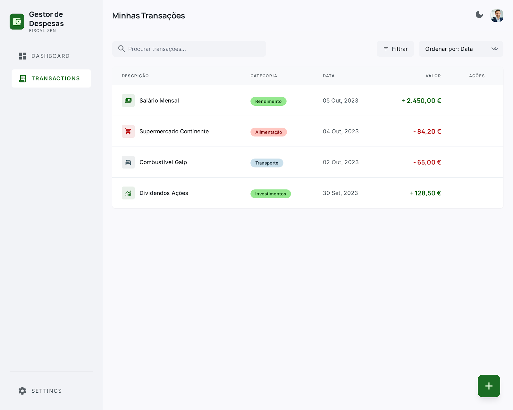
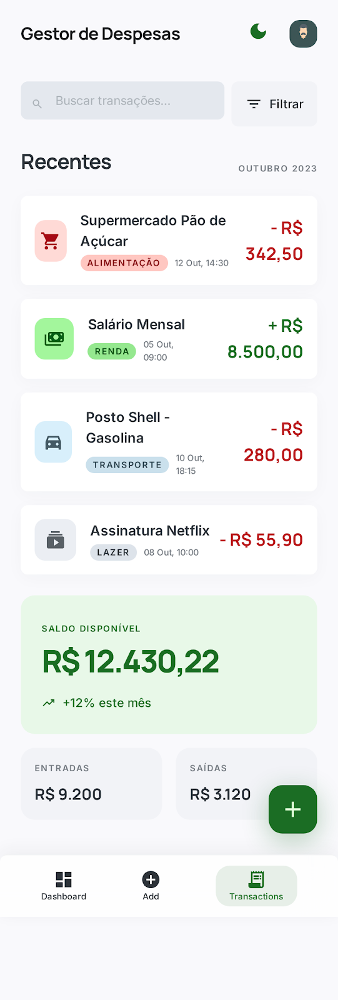

# 🚀 UPskill - Módulo 06 React

Uma aplicação *Single Page Application* (SPA) desenvolvida em React para gestão financeira pessoal. O objetivo é fornecer uma ferramenta simples, intuitiva e em tempo real para ajudar os utilizadores a responderem às perguntas: "onde está o meu dinheiro?", "o que entra?", "o que sai?" e "quanto me sobra?".

###  Links Úteis
* [Repositório.](https://github.com/devgabrielpanta/upskill-m06-react)

###  Créditos

* Gabriel: [@devgabrielpanta](https://www.github.com/devgabrielpanta)
* Antonio: [@antoniocfigueira](https://www.github.com/antoniocfigueira)

### 📸 Preview do App

<table align="center">
  <tr>
    <td align="center">
      <br>
      <b>Transações - Desktop</b>
    </td>
    <td align="center">
      <br>
      <b>Transações - Mobile</b>
    </td>
  </tr>
</table>

## ✨ Funcionalidades

* **Dashboard Resumo:** Visualização rápida do saldo atual, total de receitas e total de despesas.
* **Gestão de Transações:** Adição e eliminação de transações (receitas e despesas) com atualização de estado em tempo real.
* **Interface Responsiva:** A lista de transações adapta-se ao dispositivo do utilizador, exibindo uma tabela detalhada em Desktop e cartões (*cards*) compactos em Mobile.
* **Filtros e Ordenação Avançada:** Barra de controlo com pesquisa por texto, ordenação (por data, valor ou descrição por defeito) e uma *sidebar* interativa para filtros de tipo e categoria.
* **Adição Fluida:** Botão flutuante (FAB) no canto inferior que se expande num *Modal* focado para a criação de novas transações, mantendo a tela limpa.
* **Design Sóbrio e Moderno:** Interface minimalista, estritamente neutra, com destaque a cores apenas para feedback financeiro (verde para entradas, vermelho para saídas).
* **Modos de Visualização:** Suporte integrado para alternância entre *Light Mode* e *Dark Mode*.
* **Persistência de Dados:** Integração com `localStorage` para garantir que o histórico sobrevive ao *refresh* da página.

---

## 🛠️ Tecnologias Utilizadas

* **Frontend:** React (Hooks: `useState`, `useEffect`)
* **Estilização:** CSS / Tailwind CSS (arquitetura pensada para temas claro/escuro)
* **Armazenamento Local:** Browser `localStorage`
* **Mock Data:** Ficheiros locais para simulação de base de dados durante as fases iniciais.

---

## 🏗️ Arquitetura e Componentes

O projeto adota uma estrutura modularizada para facilitar a manutenção, focando-se em duas vistas principais: **Home/Dashboard** (Gráficos e Resumo) e **Página de Transações**.

### Principais Componentes (Página de Transações)
* `Header`: Navegação superior com logótipo e alternador de tema.
* `TransactionController`: Barra de pesquisa, seletor de ordenação e gatilho para os filtros.
* `FilterSidebar`: Menu lateral (*offcanvas*) para aplicar filtros cruzados (categoria e tipo).
* `TransactionList`: Renderiza `TransactionItem` num formato de grelha/tabela ou lista de cartões baseando-se no *viewport*.
* `TransactionForm`: Componente de estado duplo (Botão Flutuante $\rightarrow$ Modal de submissão).

---

## 🚀 Como Executar o Projeto Localmente

1. **Clonar o repositório:**
   ```bash
   git clone [https://github.com/teu-usuario/gestor-despesas.git](https://github.com/teu-usuario/gestor-despesas.git)
   ```

2. **Clonar o repositório:**
   ```bash
    cd gestor-despesas
   ```

3. **Instalar as dependências:**
   ```bash
        npm install
        # ou yarn install
   ```

4. **Instalar as dependências:**
   ```bash
        npm run dev
        # ou npm start
   ```
A aplicação ficará disponível no seu browser em http://localhost:3000 (ou 5173 se usar Vite).